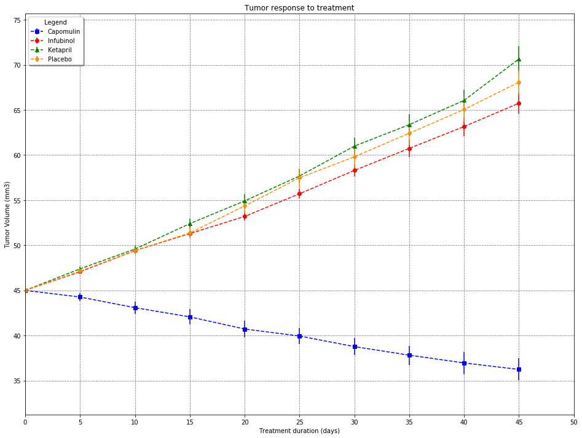
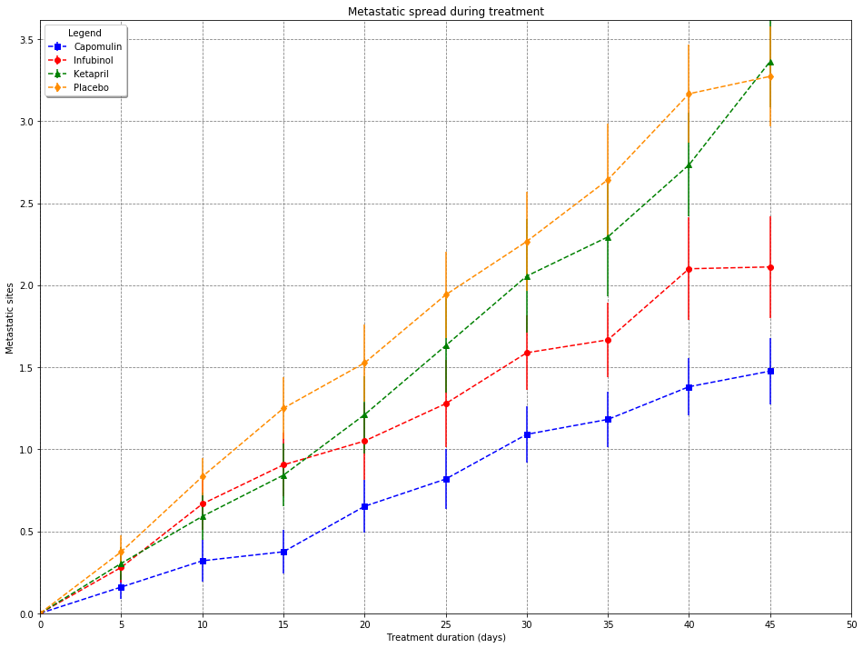
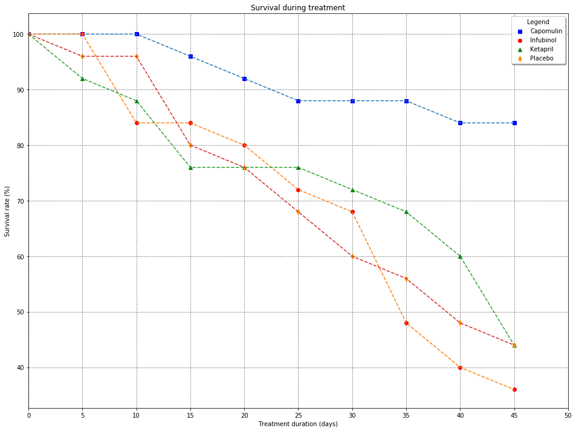
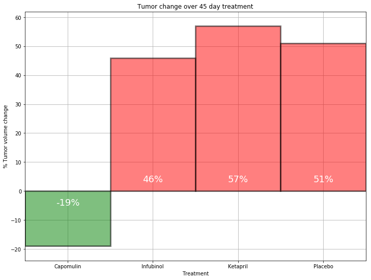

# Analysis findings

## Goal: analyze how four treatments (Capomulin, Infubinol, Ketapril, and Placebo) compare.
### Additionally, pivot tables were created showing results for all treatments:

+ Capomulin
+ Ceftamin
+ Infubinol
+ Ketapril
+ Naftisol
+ Placebo 	
+ Propriva 	
+ Ramicane
+ Stelasyn
+ Zoniferol

### Overview of additional pivot tables

+ Pivot table for tumor volume changes for all trial treatments
+ Pivot table for metastatic changes over time for all trial treatments
+ Pivot table for absolute survival rates per timepoint for all trial treatments
+ Pivot table for relative survival rates per timepoint for all trial treatments

## Findings for selected treatments (Capomulin, Infubinol, Ketapril, Placebo)

+ On average, tumor volume went down for mice treated with Capomuin (tumor volume went down by 19%). 
  All other treatments show a raise in tumor volume, varying from 46% to 57%.
+ On average, survival rates are highest when treated with Capomulin (84%). 
  All other treatments show a much lower survival rate, varying from 44% to 36%. 
+ On average, Capomulin shows the lowest number of metastatic sites (1.5). 
  However, one should take into account that the SE appears to be quite large (0.2, over 10% of 1.50. 
  You might want to run more tests. 
  On the other hand, treatment with Capomulin resulted in a 19% decrease in tumor volume, 
  which seems to indicate that Capomulin does have a positive effect.    

## Data preparation


```python
# Dependencies
import matplotlib.pyplot as plt
import pandas as pd
import numpy as np
import os
```


```python
# Load mouse data into dataframe
input_file = input("Enter the name of the mouse data file you want to analyze (without extension): ") + ".csv"
# Set file path (input file should be located on the same level as the folder raw_data)
mouse_data_file = os.path.join('raw_data', input_file) #mouse_drug_data
# Create dataframe
mouse_df = pd.read_csv(mouse_data_file)
mouse_df.head()
```

    Enter the name of the mouse data file you want to analyze (without extension): mouse_drug_data
    


<div>
<style scoped>
    .dataframe tbody tr th:only-of-type {
        vertical-align: middle;
    }

    .dataframe tbody tr th {
        vertical-align: top;
    }

    .dataframe thead th {
        text-align: right;
    }
</style>
<table border="1" class="dataframe">
  <thead>
    <tr style="text-align: right;">
      <th></th>
      <th>Mouse ID</th>
      <th>Drug</th>
    </tr>
  </thead>
  <tbody>
    <tr>
      <th>0</th>
      <td>f234</td>
      <td>Stelasyn</td>
    </tr>
    <tr>
      <th>1</th>
      <td>x402</td>
      <td>Stelasyn</td>
    </tr>
    <tr>
      <th>2</th>
      <td>a492</td>
      <td>Stelasyn</td>
    </tr>
    <tr>
      <th>3</th>
      <td>w540</td>
      <td>Stelasyn</td>
    </tr>
    <tr>
      <th>4</th>
      <td>v764</td>
      <td>Stelasyn</td>
    </tr>
  </tbody>
</table>
</div>


```python
# Load trial data into dataframe
input_file = input("Enter the name of the trial data file you want to analyze (without extension): ") + ".csv"
# Set file path (input file should be located on the same level as the folder raw_data)
trial_data_file = os.path.join('raw_data', input_file) #clinicaltrial_data
# Create dataframe
trial_df = pd.read_csv(trial_data_file)
trial_df.head()
```

    Enter the name of the trial data file you want to analyze (without extension): clinicaltrial_data
    


<div>
<style scoped>
    .dataframe tbody tr th:only-of-type {
        vertical-align: middle;
    }

    .dataframe tbody tr th {
        vertical-align: top;
    }

    .dataframe thead th {
        text-align: right;
    }
</style>
<table border="1" class="dataframe">
  <thead>
    <tr style="text-align: right;">
      <th></th>
      <th>Mouse ID</th>
      <th>Timepoint</th>
      <th>Tumor Volume (mm3)</th>
      <th>Metastatic Sites</th>
    </tr>
  </thead>
  <tbody>
    <tr>
      <th>0</th>
      <td>b128</td>
      <td>0</td>
      <td>45.0</td>
      <td>0</td>
    </tr>
    <tr>
      <th>1</th>
      <td>f932</td>
      <td>0</td>
      <td>45.0</td>
      <td>0</td>
    </tr>
    <tr>
      <th>2</th>
      <td>g107</td>
      <td>0</td>
      <td>45.0</td>
      <td>0</td>
    </tr>
    <tr>
      <th>3</th>
      <td>a457</td>
      <td>0</td>
      <td>45.0</td>
      <td>0</td>
    </tr>
    <tr>
      <th>4</th>
      <td>c819</td>
      <td>0</td>
      <td>45.0</td>
      <td>0</td>
    </tr>
  </tbody>
</table>
</div>


```python
# Delete mice with more than one treatment
x = mouse_df[mouse_df.duplicated(["Mouse ID"], keep=False)]["Mouse ID"].unique()
x.tolist()
if len(x) != 0:
    mouse_df = mouse_df[~mouse_df["Mouse ID"].isin(x)]
```


```python
# Merge mouse and trial data
merge_df = pd.merge(trial_df, mouse_df, on = "Mouse ID", how = "inner")
merge_df.head()
```


<div>
<style scoped>
    .dataframe tbody tr th:only-of-type {
        vertical-align: middle;
    }

    .dataframe tbody tr th {
        vertical-align: top;
    }

    .dataframe thead th {
        text-align: right;
    }
</style>
<table border="1" class="dataframe">
  <thead>
    <tr style="text-align: right;">
      <th></th>
      <th>Mouse ID</th>
      <th>Timepoint</th>
      <th>Tumor Volume (mm3)</th>
      <th>Metastatic Sites</th>
      <th>Drug</th>
    </tr>
  </thead>
  <tbody>
    <tr>
      <th>0</th>
      <td>b128</td>
      <td>0</td>
      <td>45.000000</td>
      <td>0</td>
      <td>Capomulin</td>
    </tr>
    <tr>
      <th>1</th>
      <td>b128</td>
      <td>5</td>
      <td>45.651331</td>
      <td>0</td>
      <td>Capomulin</td>
    </tr>
    <tr>
      <th>2</th>
      <td>b128</td>
      <td>10</td>
      <td>43.270852</td>
      <td>0</td>
      <td>Capomulin</td>
    </tr>
    <tr>
      <th>3</th>
      <td>b128</td>
      <td>15</td>
      <td>43.784893</td>
      <td>0</td>
      <td>Capomulin</td>
    </tr>
    <tr>
      <th>4</th>
      <td>b128</td>
      <td>20</td>
      <td>42.731552</td>
      <td>0</td>
      <td>Capomulin</td>
    </tr>
  </tbody>
</table>
</div>


```python
# After merging, you should check whether there's any rows having:
# - the same combination for Mouse ID, Timepoint and Drug but different values for either 
#   Tumor Volume (mm3) or Metastatic Sites
# If so, these rows should be deleted
```


```python
# Standard list with treatments we'll be analyzing
drug_list = ["Capomulin", "Infubinol", "Ketapril", "Placebo"]
```


```python
# (Optional) create new list of treatments to be analyzed
full_drug_list = []
for item in merge_df["Drug"].unique():
    full_drug_list.append(item)
# Select treatments to be analyzed
print(f"Current analysis is done for these treatments: {[x for x in drug_list]}")
create_new_list = input("Type Y for new analysis")
if create_new_list == "Y":
    print(f"""Available for analysis:
        {[x for x in full_drug_list]}""")
    new_list = input("Enter treatments, separate multiple values by a comma")
    drug_list = list(set(new_list.split(",")))
print(f"New analysis will be done for these treatments: {[x for x in drug_list]}")
```

    Current analysis is done for these treatments: ['Capomulin', 'Infubinol', 'Ketapril', 'Placebo']
    


```python
# There should not be any gaps in Timepoints
# In this case, Timepoints are an arithmetic progression
# So you can check the sum of the arithmetic progression against the sum of the Timepoints per mouse
# Both sums should be equal. IF not, there's a gap and you should delete the trial data for all mice involved.
# Sum of interval per mouse = nr of timepoints*0.5*(first value + last value)
interval_check = merge_df.groupby(["Mouse ID"], as_index=False)["Timepoint"].agg(["sum","count","first","last"])
interval_check = interval_check.reset_index()
interval_check["Arithmetic sum"] = 0.5*interval_check["count"]*(interval_check["first"]+interval_check["last"])

x = interval_check.loc[~(interval_check["sum"] == interval_check["Arithmetic sum"])]
gap_list = []
for mouse in x["Mouse ID"]:
    gap_list.append(mouse)
merge_df = merge_df[~merge_df["Mouse ID"].isin(gap_list)]
```

## Analysis

### Tumor volume over time for all trial treatments


```python
# Calculate mean and SE over mean for tumor volume change per treatment
tumor_volume_average = merge_df.groupby(["Drug", "Timepoint"], as_index=False)["Tumor Volume (mm3)"].agg(["mean","sem"])

tumor_volume_avg_df = pd.DataFrame(tumor_volume_average).reset_index()
tumor_volume_avg_df=tumor_volume_avg_df.rename(columns = {"mean":"Tumor Volume (mm3)","sem":"Tumor Volume SE"})
tumor_volume_avg_df.head()
```


<div>
<style scoped>
    .dataframe tbody tr th:only-of-type {
        vertical-align: middle;
    }

    .dataframe tbody tr th {
        vertical-align: top;
    }

    .dataframe thead th {
        text-align: right;
    }
</style>
<table border="1" class="dataframe">
  <thead>
    <tr style="text-align: right;">
      <th></th>
      <th>Drug</th>
      <th>Timepoint</th>
      <th>Tumor Volume (mm3)</th>
      <th>Tumor Volume SE</th>
    </tr>
  </thead>
  <tbody>
    <tr>
      <th>0</th>
      <td>Capomulin</td>
      <td>0</td>
      <td>45.000000</td>
      <td>0.000000</td>
    </tr>
    <tr>
      <th>1</th>
      <td>Capomulin</td>
      <td>5</td>
      <td>44.266086</td>
      <td>0.448593</td>
    </tr>
    <tr>
      <th>2</th>
      <td>Capomulin</td>
      <td>10</td>
      <td>43.084291</td>
      <td>0.702684</td>
    </tr>
    <tr>
      <th>3</th>
      <td>Capomulin</td>
      <td>15</td>
      <td>42.064317</td>
      <td>0.838617</td>
    </tr>
    <tr>
      <th>4</th>
      <td>Capomulin</td>
      <td>20</td>
      <td>40.716325</td>
      <td>0.909731</td>
    </tr>
  </tbody>
</table>
</div>


### Pivot table for tumor volume changes for all trial treatments


```python
# Tumor volume changes over time for all treatments; pivot table
pd.pivot_table(merge_df, index = ["Timepoint"], values = "Tumor Volume (mm3)", 
               columns = ["Drug"], aggfunc = "mean")
```


<div>
<style scoped>
    .dataframe tbody tr th:only-of-type {
        vertical-align: middle;
    }

    .dataframe tbody tr th {
        vertical-align: top;
    }

    .dataframe thead th {
        text-align: right;
    }
</style>
<table border="1" class="dataframe">
  <thead>
    <tr style="text-align: right;">
      <th>Drug</th>
      <th>Capomulin</th>
      <th>Ceftamin</th>
      <th>Infubinol</th>
      <th>Ketapril</th>
      <th>Naftisol</th>
      <th>Placebo</th>
      <th>Propriva</th>
      <th>Ramicane</th>
      <th>Stelasyn</th>
      <th>Zoniferol</th>
    </tr>
    <tr>
      <th>Timepoint</th>
      <th></th>
      <th></th>
      <th></th>
      <th></th>
      <th></th>
      <th></th>
      <th></th>
      <th></th>
      <th></th>
      <th></th>
    </tr>
  </thead>
  <tbody>
    <tr>
      <th>0</th>
      <td>45.000000</td>
      <td>45.000000</td>
      <td>45.000000</td>
      <td>45.000000</td>
      <td>45.000000</td>
      <td>45.000000</td>
      <td>45.000000</td>
      <td>45.000000</td>
      <td>45.000000</td>
      <td>45.000000</td>
    </tr>
    <tr>
      <th>5</th>
      <td>44.266086</td>
      <td>46.503051</td>
      <td>47.062001</td>
      <td>47.389175</td>
      <td>46.796098</td>
      <td>47.125589</td>
      <td>47.168130</td>
      <td>43.944859</td>
      <td>47.470830</td>
      <td>46.851818</td>
    </tr>
    <tr>
      <th>10</th>
      <td>43.084291</td>
      <td>48.285125</td>
      <td>49.403909</td>
      <td>49.582269</td>
      <td>48.694210</td>
      <td>49.423329</td>
      <td>48.938560</td>
      <td>42.531957</td>
      <td>49.335368</td>
      <td>48.689881</td>
    </tr>
    <tr>
      <th>15</th>
      <td>42.064317</td>
      <td>50.094055</td>
      <td>51.296397</td>
      <td>52.399974</td>
      <td>50.933018</td>
      <td>51.359742</td>
      <td>50.891769</td>
      <td>41.495061</td>
      <td>51.448025</td>
      <td>50.779059</td>
    </tr>
    <tr>
      <th>20</th>
      <td>40.716325</td>
      <td>52.157049</td>
      <td>53.197691</td>
      <td>54.920935</td>
      <td>53.644087</td>
      <td>54.364417</td>
      <td>53.127384</td>
      <td>40.238325</td>
      <td>53.970080</td>
      <td>53.170334</td>
    </tr>
    <tr>
      <th>25</th>
      <td>39.939528</td>
      <td>54.287674</td>
      <td>55.715252</td>
      <td>57.678982</td>
      <td>56.731968</td>
      <td>57.482574</td>
      <td>55.462490</td>
      <td>38.974300</td>
      <td>56.172821</td>
      <td>55.432935</td>
    </tr>
    <tr>
      <th>30</th>
      <td>38.769339</td>
      <td>56.769517</td>
      <td>58.299397</td>
      <td>60.994507</td>
      <td>59.559509</td>
      <td>59.809063</td>
      <td>58.122548</td>
      <td>38.703137</td>
      <td>59.870528</td>
      <td>57.713531</td>
    </tr>
    <tr>
      <th>35</th>
      <td>37.816839</td>
      <td>58.827548</td>
      <td>60.742461</td>
      <td>63.371686</td>
      <td>62.685087</td>
      <td>62.420615</td>
      <td>60.103457</td>
      <td>37.451996</td>
      <td>62.432021</td>
      <td>60.089372</td>
    </tr>
    <tr>
      <th>40</th>
      <td>36.958001</td>
      <td>61.467895</td>
      <td>63.162824</td>
      <td>66.068580</td>
      <td>65.600754</td>
      <td>65.052675</td>
      <td>63.045537</td>
      <td>36.574081</td>
      <td>65.356386</td>
      <td>62.916692</td>
    </tr>
    <tr>
      <th>45</th>
      <td>36.236114</td>
      <td>64.132421</td>
      <td>65.755562</td>
      <td>70.662958</td>
      <td>69.265506</td>
      <td>68.084082</td>
      <td>66.258529</td>
      <td>34.955595</td>
      <td>68.438310</td>
      <td>65.960888</td>
    </tr>
  </tbody>
</table>
</div>


### Tumor volume changes over time for selected treatments including SE mean; plot


```python
# Grab values for selected treatments
tumor_volume_avg_df = tumor_volume_avg_df[tumor_volume_avg_df["Drug"].isin(drug_list)]

min_value = tumor_volume_avg_df["Tumor Volume (mm3)"].min()
max_value = tumor_volume_avg_df["Tumor Volume (mm3)"].max()
colors = ["blue", "red", "green","darkorange"]
markers = ["s","o","^","d"]

plt.xlim(0, 50)
plt.ylim(min_value - 5,max_value +5)
plt.xlabel("Treatment duration (days)")
plt.ylabel("Tumor Volume (mm3)")
plt.title("Tumor response to treatment")

for i, drug in enumerate(tumor_volume_avg_df["Drug"].unique()):
    x = tumor_volume_avg_df[tumor_volume_avg_df["Drug"]==drug]["Timepoint"]
    y = tumor_volume_avg_df[tumor_volume_avg_df["Drug"]==drug]["Tumor Volume (mm3)"]
    e = tumor_volume_avg_df[tumor_volume_avg_df["Drug"]==drug]["Tumor Volume SE"]
    plt.errorbar(x, y, yerr = e, label = drug, marker = markers[i], color = colors[i], linestyle ="dashed")
             
plt.legend(loc="best", ncol=1, shadow=True, title="Legend", fancybox=True)
plt.grid(color='gray', linestyle='dashed')
plt.rcParams['axes.axisbelow'] = True
plt.rcParams["figure.figsize"] = [16,12]
plt.xticks(np.arange(min(x), max(x)+10, 5.0))
plt.show()
```





### Metastatic Sites changes over time per selected treatment


```python
# Metastatic Sites changes over time per selected treatment
metastatic_avg_df = merge_df.groupby(["Drug", "Timepoint"], as_index = False)["Metastatic Sites"].agg(["mean","sem"])
metastatic_avg_df = pd.DataFrame(metastatic_avg_df).reset_index()
metastatic_avg_df=metastatic_avg_df.rename(columns = {"mean":"Metastatic Sites","sem":"Metastatic Sites SE"})

metastatic_avg_df.head()
```


<div>
<style scoped>
    .dataframe tbody tr th:only-of-type {
        vertical-align: middle;
    }

    .dataframe tbody tr th {
        vertical-align: top;
    }

    .dataframe thead th {
        text-align: right;
    }
</style>
<table border="1" class="dataframe">
  <thead>
    <tr style="text-align: right;">
      <th></th>
      <th>Drug</th>
      <th>Timepoint</th>
      <th>Metastatic Sites</th>
      <th>Metastatic Sites SE</th>
    </tr>
  </thead>
  <tbody>
    <tr>
      <th>0</th>
      <td>Capomulin</td>
      <td>0</td>
      <td>0.000000</td>
      <td>0.000000</td>
    </tr>
    <tr>
      <th>1</th>
      <td>Capomulin</td>
      <td>5</td>
      <td>0.160000</td>
      <td>0.074833</td>
    </tr>
    <tr>
      <th>2</th>
      <td>Capomulin</td>
      <td>10</td>
      <td>0.320000</td>
      <td>0.125433</td>
    </tr>
    <tr>
      <th>3</th>
      <td>Capomulin</td>
      <td>15</td>
      <td>0.375000</td>
      <td>0.132048</td>
    </tr>
    <tr>
      <th>4</th>
      <td>Capomulin</td>
      <td>20</td>
      <td>0.652174</td>
      <td>0.161621</td>
    </tr>
  </tbody>
</table>
</div>


### Pivot table for metastatic changes over time for all trial treatments


```python
pd.pivot_table(merge_df, index = ["Timepoint"], columns = ["Drug"], values = "Metastatic Sites", aggfunc = "mean")
```


<div>
<style scoped>
    .dataframe tbody tr th:only-of-type {
        vertical-align: middle;
    }

    .dataframe tbody tr th {
        vertical-align: top;
    }

    .dataframe thead th {
        text-align: right;
    }
</style>
<table border="1" class="dataframe">
  <thead>
    <tr style="text-align: right;">
      <th>Drug</th>
      <th>Capomulin</th>
      <th>Ceftamin</th>
      <th>Infubinol</th>
      <th>Ketapril</th>
      <th>Naftisol</th>
      <th>Placebo</th>
      <th>Propriva</th>
      <th>Ramicane</th>
      <th>Stelasyn</th>
      <th>Zoniferol</th>
    </tr>
    <tr>
      <th>Timepoint</th>
      <th></th>
      <th></th>
      <th></th>
      <th></th>
      <th></th>
      <th></th>
      <th></th>
      <th></th>
      <th></th>
      <th></th>
    </tr>
  </thead>
  <tbody>
    <tr>
      <th>0</th>
      <td>0.000000</td>
      <td>0.000000</td>
      <td>0.000000</td>
      <td>0.000000</td>
      <td>0.000000</td>
      <td>0.000000</td>
      <td>0.000000</td>
      <td>0.000000</td>
      <td>0.000000</td>
      <td>0.000000</td>
    </tr>
    <tr>
      <th>5</th>
      <td>0.160000</td>
      <td>0.380952</td>
      <td>0.280000</td>
      <td>0.304348</td>
      <td>0.260870</td>
      <td>0.375000</td>
      <td>0.347826</td>
      <td>0.120000</td>
      <td>0.260870</td>
      <td>0.166667</td>
    </tr>
    <tr>
      <th>10</th>
      <td>0.320000</td>
      <td>0.600000</td>
      <td>0.666667</td>
      <td>0.590909</td>
      <td>0.523810</td>
      <td>0.833333</td>
      <td>0.619048</td>
      <td>0.250000</td>
      <td>0.523810</td>
      <td>0.500000</td>
    </tr>
    <tr>
      <th>15</th>
      <td>0.375000</td>
      <td>0.789474</td>
      <td>0.904762</td>
      <td>0.842105</td>
      <td>0.857143</td>
      <td>1.250000</td>
      <td>0.800000</td>
      <td>0.333333</td>
      <td>0.809524</td>
      <td>0.809524</td>
    </tr>
    <tr>
      <th>20</th>
      <td>0.652174</td>
      <td>1.111111</td>
      <td>1.050000</td>
      <td>1.210526</td>
      <td>1.150000</td>
      <td>1.526316</td>
      <td>1.000000</td>
      <td>0.347826</td>
      <td>0.947368</td>
      <td>1.294118</td>
    </tr>
    <tr>
      <th>25</th>
      <td>0.818182</td>
      <td>1.500000</td>
      <td>1.277778</td>
      <td>1.631579</td>
      <td>1.500000</td>
      <td>1.941176</td>
      <td>1.384615</td>
      <td>0.652174</td>
      <td>1.166667</td>
      <td>1.687500</td>
    </tr>
    <tr>
      <th>30</th>
      <td>1.090909</td>
      <td>1.937500</td>
      <td>1.588235</td>
      <td>2.055556</td>
      <td>2.066667</td>
      <td>2.266667</td>
      <td>1.666667</td>
      <td>0.782609</td>
      <td>1.411765</td>
      <td>1.933333</td>
    </tr>
    <tr>
      <th>35</th>
      <td>1.181818</td>
      <td>2.071429</td>
      <td>1.666667</td>
      <td>2.294118</td>
      <td>2.266667</td>
      <td>2.642857</td>
      <td>2.333333</td>
      <td>0.952381</td>
      <td>1.533333</td>
      <td>2.285714</td>
    </tr>
    <tr>
      <th>40</th>
      <td>1.380952</td>
      <td>2.357143</td>
      <td>2.100000</td>
      <td>2.733333</td>
      <td>2.466667</td>
      <td>3.166667</td>
      <td>2.777778</td>
      <td>1.100000</td>
      <td>1.583333</td>
      <td>2.785714</td>
    </tr>
    <tr>
      <th>45</th>
      <td>1.476190</td>
      <td>2.692308</td>
      <td>2.111111</td>
      <td>3.363636</td>
      <td>2.538462</td>
      <td>3.272727</td>
      <td>2.571429</td>
      <td>1.250000</td>
      <td>1.727273</td>
      <td>3.071429</td>
    </tr>
  </tbody>
</table>
</div>


### Metastatic Sites changes over time for selected treatments including SE over mean; plot


```python
# Grab values for selected treatments
metastatic_avg_df = metastatic_avg_df[metastatic_avg_df["Drug"].isin(drug_list)]

max_value = metastatic_avg_df["Metastatic Sites"].max()
colors = ["blue", "red", "green","darkorange"]
markers = ["s","o","^","d"]

plt.xlim(0, 50)
plt.ylim(0, max_value + 0.25)
plt.xlabel("Treatment duration (days)")
plt.ylabel("Metastatic sites")
plt.title("Metastatic spread during treatment")

for i, drug in enumerate(metastatic_avg_df["Drug"].unique()):
    x = metastatic_avg_df[metastatic_avg_df["Drug"]==drug]["Timepoint"]
    y = metastatic_avg_df[metastatic_avg_df["Drug"]==drug]["Metastatic Sites"]
    e = metastatic_avg_df[metastatic_avg_df["Drug"]==drug]["Metastatic Sites SE"]
    plt.errorbar(x, y, yerr = e, label = drug, marker = markers[i], color = colors[i], linestyle ="dashed")
    #plt.plot(x, y, label = "",linestyle = '-')

plt.legend(loc="best", ncol=1, shadow=True, title="Legend", fancybox=True)
plt.grid(color='gray', linestyle='dashed')
plt.rcParams['axes.axisbelow'] = True
plt.rcParams["figure.figsize"] = [16,12]
plt.xticks(np.arange(min(x), max(x)+10, 5.0))
plt.show()
```





### Absolute survival rates per timepoint for all trial treatments


```python
timepoint_df = merge_df.groupby(["Drug", "Timepoint"], as_index=False)["Mouse ID"].count()
timepoint_df = pd.DataFrame(timepoint_df)
timepoint_df = timepoint_df.rename(columns = {"Mouse ID":"Mouse Count"})
timepoint_df.head()
```


<div>
<style scoped>
    .dataframe tbody tr th:only-of-type {
        vertical-align: middle;
    }

    .dataframe tbody tr th {
        vertical-align: top;
    }

    .dataframe thead th {
        text-align: right;
    }
</style>
<table border="1" class="dataframe">
  <thead>
    <tr style="text-align: right;">
      <th></th>
      <th>Drug</th>
      <th>Timepoint</th>
      <th>Mouse Count</th>
    </tr>
  </thead>
  <tbody>
    <tr>
      <th>0</th>
      <td>Capomulin</td>
      <td>0</td>
      <td>25</td>
    </tr>
    <tr>
      <th>1</th>
      <td>Capomulin</td>
      <td>5</td>
      <td>25</td>
    </tr>
    <tr>
      <th>2</th>
      <td>Capomulin</td>
      <td>10</td>
      <td>25</td>
    </tr>
    <tr>
      <th>3</th>
      <td>Capomulin</td>
      <td>15</td>
      <td>24</td>
    </tr>
    <tr>
      <th>4</th>
      <td>Capomulin</td>
      <td>20</td>
      <td>23</td>
    </tr>
  </tbody>
</table>
</div>


### Pivot table for absolute survival rates per timepoint for all trial treatments


```python
pd.pivot_table(merge_df, index = ["Timepoint"], columns = ["Drug"], values = "Metastatic Sites", aggfunc = "count")
```


<div>
<style scoped>
    .dataframe tbody tr th:only-of-type {
        vertical-align: middle;
    }

    .dataframe tbody tr th {
        vertical-align: top;
    }

    .dataframe thead th {
        text-align: right;
    }
</style>
<table border="1" class="dataframe">
  <thead>
    <tr style="text-align: right;">
      <th>Drug</th>
      <th>Capomulin</th>
      <th>Ceftamin</th>
      <th>Infubinol</th>
      <th>Ketapril</th>
      <th>Naftisol</th>
      <th>Placebo</th>
      <th>Propriva</th>
      <th>Ramicane</th>
      <th>Stelasyn</th>
      <th>Zoniferol</th>
    </tr>
    <tr>
      <th>Timepoint</th>
      <th></th>
      <th></th>
      <th></th>
      <th></th>
      <th></th>
      <th></th>
      <th></th>
      <th></th>
      <th></th>
      <th></th>
    </tr>
  </thead>
  <tbody>
    <tr>
      <th>0</th>
      <td>25</td>
      <td>25</td>
      <td>25</td>
      <td>25</td>
      <td>25</td>
      <td>25</td>
      <td>24</td>
      <td>25</td>
      <td>24</td>
      <td>25</td>
    </tr>
    <tr>
      <th>5</th>
      <td>25</td>
      <td>21</td>
      <td>25</td>
      <td>23</td>
      <td>23</td>
      <td>24</td>
      <td>23</td>
      <td>25</td>
      <td>23</td>
      <td>24</td>
    </tr>
    <tr>
      <th>10</th>
      <td>25</td>
      <td>20</td>
      <td>21</td>
      <td>22</td>
      <td>21</td>
      <td>24</td>
      <td>21</td>
      <td>24</td>
      <td>21</td>
      <td>22</td>
    </tr>
    <tr>
      <th>15</th>
      <td>24</td>
      <td>19</td>
      <td>21</td>
      <td>19</td>
      <td>21</td>
      <td>20</td>
      <td>15</td>
      <td>24</td>
      <td>21</td>
      <td>21</td>
    </tr>
    <tr>
      <th>20</th>
      <td>23</td>
      <td>18</td>
      <td>20</td>
      <td>19</td>
      <td>20</td>
      <td>19</td>
      <td>15</td>
      <td>23</td>
      <td>19</td>
      <td>17</td>
    </tr>
    <tr>
      <th>25</th>
      <td>22</td>
      <td>18</td>
      <td>18</td>
      <td>19</td>
      <td>18</td>
      <td>17</td>
      <td>13</td>
      <td>23</td>
      <td>18</td>
      <td>16</td>
    </tr>
    <tr>
      <th>30</th>
      <td>22</td>
      <td>16</td>
      <td>17</td>
      <td>18</td>
      <td>15</td>
      <td>15</td>
      <td>12</td>
      <td>23</td>
      <td>17</td>
      <td>15</td>
    </tr>
    <tr>
      <th>35</th>
      <td>22</td>
      <td>14</td>
      <td>12</td>
      <td>17</td>
      <td>15</td>
      <td>14</td>
      <td>9</td>
      <td>21</td>
      <td>15</td>
      <td>14</td>
    </tr>
    <tr>
      <th>40</th>
      <td>21</td>
      <td>14</td>
      <td>10</td>
      <td>15</td>
      <td>15</td>
      <td>12</td>
      <td>9</td>
      <td>20</td>
      <td>12</td>
      <td>14</td>
    </tr>
    <tr>
      <th>45</th>
      <td>21</td>
      <td>13</td>
      <td>9</td>
      <td>11</td>
      <td>13</td>
      <td>11</td>
      <td>7</td>
      <td>20</td>
      <td>11</td>
      <td>14</td>
    </tr>
  </tbody>
</table>
</div>


```python
# Relative survival rates per treatment per timepoint
timepoint_df["Survival rate (%)"] = 100*(1+(timepoint_df["Mouse Count"] - timepoint_df.iloc[0]["Mouse Count"]) / timepoint_df.iloc[0]["Mouse Count"])
timepoint_df.head()
```


<div>
<style scoped>
    .dataframe tbody tr th:only-of-type {
        vertical-align: middle;
    }

    .dataframe tbody tr th {
        vertical-align: top;
    }

    .dataframe thead th {
        text-align: right;
    }
</style>
<table border="1" class="dataframe">
  <thead>
    <tr style="text-align: right;">
      <th></th>
      <th>Drug</th>
      <th>Timepoint</th>
      <th>Mouse Count</th>
      <th>Survival rate (%)</th>
    </tr>
  </thead>
  <tbody>
    <tr>
      <th>0</th>
      <td>Capomulin</td>
      <td>0</td>
      <td>25</td>
      <td>100.0</td>
    </tr>
    <tr>
      <th>1</th>
      <td>Capomulin</td>
      <td>5</td>
      <td>25</td>
      <td>100.0</td>
    </tr>
    <tr>
      <th>2</th>
      <td>Capomulin</td>
      <td>10</td>
      <td>25</td>
      <td>100.0</td>
    </tr>
    <tr>
      <th>3</th>
      <td>Capomulin</td>
      <td>15</td>
      <td>24</td>
      <td>96.0</td>
    </tr>
    <tr>
      <th>4</th>
      <td>Capomulin</td>
      <td>20</td>
      <td>23</td>
      <td>92.0</td>
    </tr>
  </tbody>
</table>
</div>


### Pivot table for relative survival rates per timepoint for all trial treatments


```python
pd.pivot_table(timepoint_df, index = ["Timepoint"], values = "Survival rate (%)", columns = ["Drug"], aggfunc = "mean")
```


<div>
<style scoped>
    .dataframe tbody tr th:only-of-type {
        vertical-align: middle;
    }

    .dataframe tbody tr th {
        vertical-align: top;
    }

    .dataframe thead th {
        text-align: right;
    }
</style>
<table border="1" class="dataframe">
  <thead>
    <tr style="text-align: right;">
      <th>Drug</th>
      <th>Capomulin</th>
      <th>Ceftamin</th>
      <th>Infubinol</th>
      <th>Ketapril</th>
      <th>Naftisol</th>
      <th>Placebo</th>
      <th>Propriva</th>
      <th>Ramicane</th>
      <th>Stelasyn</th>
      <th>Zoniferol</th>
    </tr>
    <tr>
      <th>Timepoint</th>
      <th></th>
      <th></th>
      <th></th>
      <th></th>
      <th></th>
      <th></th>
      <th></th>
      <th></th>
      <th></th>
      <th></th>
    </tr>
  </thead>
  <tbody>
    <tr>
      <th>0</th>
      <td>100.0</td>
      <td>100.0</td>
      <td>100.0</td>
      <td>100.0</td>
      <td>100.0</td>
      <td>100.0</td>
      <td>96.0</td>
      <td>100.0</td>
      <td>96.0</td>
      <td>100.0</td>
    </tr>
    <tr>
      <th>5</th>
      <td>100.0</td>
      <td>84.0</td>
      <td>100.0</td>
      <td>92.0</td>
      <td>92.0</td>
      <td>96.0</td>
      <td>92.0</td>
      <td>100.0</td>
      <td>92.0</td>
      <td>96.0</td>
    </tr>
    <tr>
      <th>10</th>
      <td>100.0</td>
      <td>80.0</td>
      <td>84.0</td>
      <td>88.0</td>
      <td>84.0</td>
      <td>96.0</td>
      <td>84.0</td>
      <td>96.0</td>
      <td>84.0</td>
      <td>88.0</td>
    </tr>
    <tr>
      <th>15</th>
      <td>96.0</td>
      <td>76.0</td>
      <td>84.0</td>
      <td>76.0</td>
      <td>84.0</td>
      <td>80.0</td>
      <td>60.0</td>
      <td>96.0</td>
      <td>84.0</td>
      <td>84.0</td>
    </tr>
    <tr>
      <th>20</th>
      <td>92.0</td>
      <td>72.0</td>
      <td>80.0</td>
      <td>76.0</td>
      <td>80.0</td>
      <td>76.0</td>
      <td>60.0</td>
      <td>92.0</td>
      <td>76.0</td>
      <td>68.0</td>
    </tr>
    <tr>
      <th>25</th>
      <td>88.0</td>
      <td>72.0</td>
      <td>72.0</td>
      <td>76.0</td>
      <td>72.0</td>
      <td>68.0</td>
      <td>52.0</td>
      <td>92.0</td>
      <td>72.0</td>
      <td>64.0</td>
    </tr>
    <tr>
      <th>30</th>
      <td>88.0</td>
      <td>64.0</td>
      <td>68.0</td>
      <td>72.0</td>
      <td>60.0</td>
      <td>60.0</td>
      <td>48.0</td>
      <td>92.0</td>
      <td>68.0</td>
      <td>60.0</td>
    </tr>
    <tr>
      <th>35</th>
      <td>88.0</td>
      <td>56.0</td>
      <td>48.0</td>
      <td>68.0</td>
      <td>60.0</td>
      <td>56.0</td>
      <td>36.0</td>
      <td>84.0</td>
      <td>60.0</td>
      <td>56.0</td>
    </tr>
    <tr>
      <th>40</th>
      <td>84.0</td>
      <td>56.0</td>
      <td>40.0</td>
      <td>60.0</td>
      <td>60.0</td>
      <td>48.0</td>
      <td>36.0</td>
      <td>80.0</td>
      <td>48.0</td>
      <td>56.0</td>
    </tr>
    <tr>
      <th>45</th>
      <td>84.0</td>
      <td>52.0</td>
      <td>36.0</td>
      <td>44.0</td>
      <td>52.0</td>
      <td>44.0</td>
      <td>28.0</td>
      <td>80.0</td>
      <td>44.0</td>
      <td>56.0</td>
    </tr>
  </tbody>
</table>
</div>


### Survival rate plot


```python
# Grab values for selected treatments
timepoint_df = timepoint_df[timepoint_df["Drug"].isin(drug_list)]

colors = ["blue", "red", "green","darkorange"]
markers = ["s","o","^","d"]

plt.xlim(0, 50)
plt.xlabel("Treatment duration (days)")
plt.ylabel("Survival rate (%)")
plt.title("Survival during treatment")

for i, drug in enumerate(timepoint_df["Drug"].unique()):
    x = timepoint_df[timepoint_df["Drug"]==drug]["Timepoint"]
    y = timepoint_df[timepoint_df["Drug"]==drug]["Survival rate (%)"]
    plt.scatter(x, y, label = drug, marker = markers[i], facecolors = colors[i])
    plt.plot(x, y, label ="", linestyle = 'dashed')

plt.legend(loc="best", ncol=1, shadow=True, title="Legend", fancybox=True)
plt.grid(color='gray', linestyle='dashed')
plt.rcParams['axes.axisbelow'] = True
plt.rcParams["figure.figsize"] = [12,9]
plt.xticks(np.arange(min(x), max(x)+10, 5.0))
plt.show()
```





### Tumor volume change per selected treatment


```python
# Get the first and last value for number of mouses per treatment

vol_change_df =tumor_volume_avg_df.groupby("Drug")["Tumor Volume (mm3)"].agg(['first','last'])
vol_change_df = pd.DataFrame(vol_change_df).reset_index()
vol_change_df["Volume Change (%)"] = round(100*(vol_change_df["last"]-vol_change_df["first"])/vol_change_df["first"]).astype(int)
vol_change_df = vol_change_df.rename(columns = {"first":"Start volume","last":"End volume"})
vol_change_df
```


<div>
<style scoped>
    .dataframe tbody tr th:only-of-type {
        vertical-align: middle;
    }

    .dataframe tbody tr th {
        vertical-align: top;
    }

    .dataframe thead th {
        text-align: right;
    }
</style>
<table border="1" class="dataframe">
  <thead>
    <tr style="text-align: right;">
      <th></th>
      <th>Drug</th>
      <th>Start volume</th>
      <th>End volume</th>
      <th>Volume Change (%)</th>
    </tr>
  </thead>
  <tbody>
    <tr>
      <th>0</th>
      <td>Capomulin</td>
      <td>45.0</td>
      <td>36.236114</td>
      <td>-19</td>
    </tr>
    <tr>
      <th>1</th>
      <td>Infubinol</td>
      <td>45.0</td>
      <td>65.755562</td>
      <td>46</td>
    </tr>
    <tr>
      <th>2</th>
      <td>Ketapril</td>
      <td>45.0</td>
      <td>70.662958</td>
      <td>57</td>
    </tr>
    <tr>
      <th>3</th>
      <td>Placebo</td>
      <td>45.0</td>
      <td>68.084082</td>
      <td>51</td>
    </tr>
  </tbody>
</table>
</div>


### Tumor volume change per selected treatment; bar plot


```python
x_axis = np.arange(len(drug_list))
barcolor= ["red" if abs(perc) == perc else "green" for perc in vol_change_df["Volume Change (%)"]]
barwidth = 1

plt.bar(x_axis, vol_change_df["Volume Change (%)"], width = barwidth, color=barcolor,
        alpha=0.5, align="edge", edgecolor = "k", linewidth=3)

for i, (perc) in enumerate(vol_change_df["Volume Change (%)"]):
    plt.text(s = "{:.0%}".format(perc/100), x = i + 0.5*barwidth, y = np.sign(perc)*4,
             color = "w", ha = "center", va = "center", size=18)

tick_locations = [value+0.5 for value in x_axis]
plt.xticks(tick_locations, drug_list)
plt.grid()

plt.xlim(0, len(drug_list))
plt.ylim(min(vol_change_df["Volume Change (%)"]) - 5, max(vol_change_df["Volume Change (%)"]) + 5)

plt.title("Tumor change over 45 day treatment")
plt.xlabel("Treatment")
plt.ylabel("% Tumor volume change")
plt.rcParams["figure.figsize"] = [9,6]
plt.show()
```




